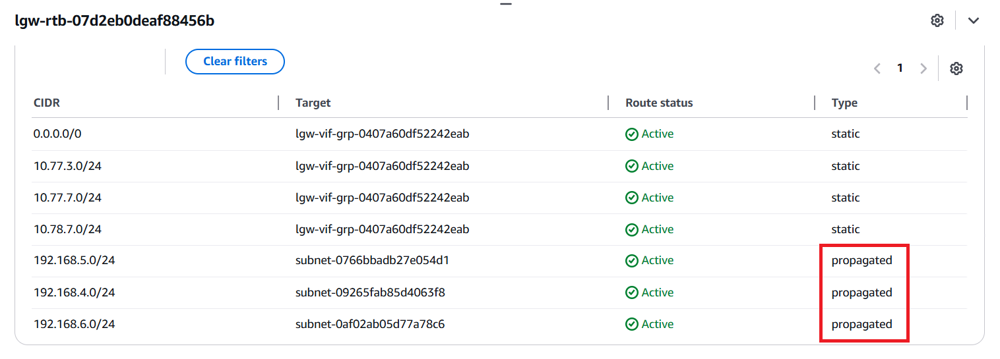
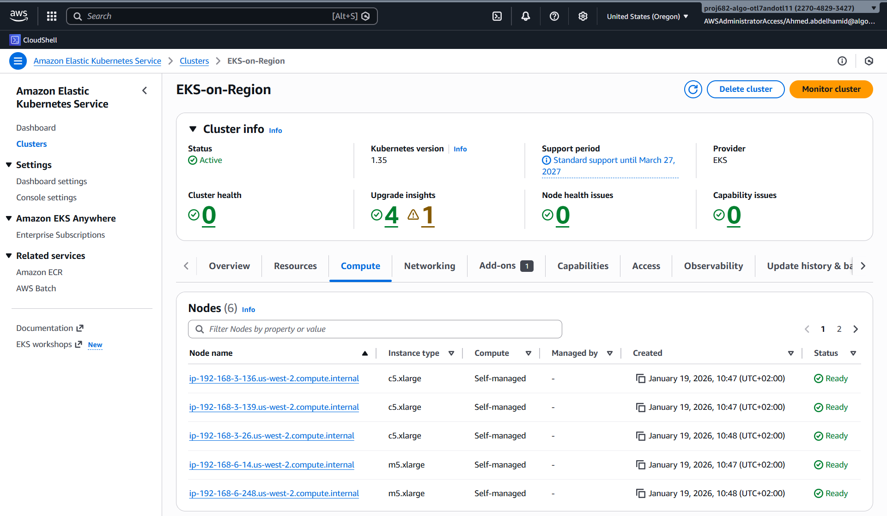
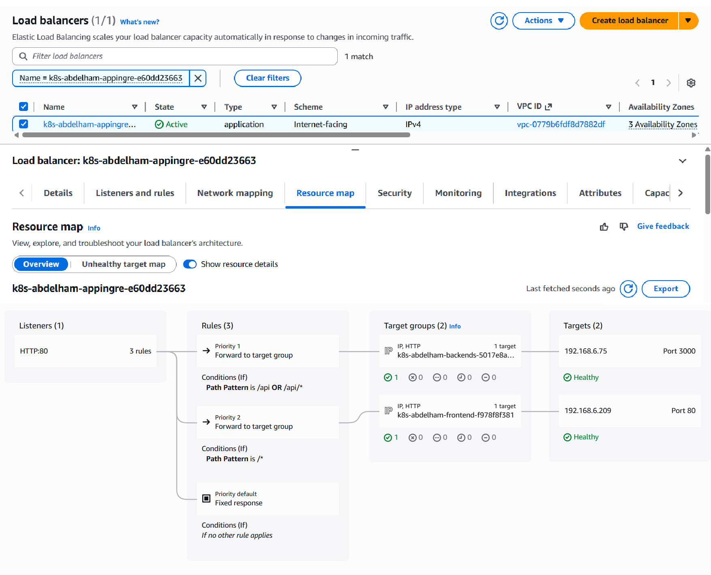

# Done Documentation Cloud (Master) & HA Worker Nodes on Outposts ✅

 

## ***Outpost Architecture Overview*** ✅

 
 
 
 
 
 
 

### **Connection between 2 AWS Outposts** ✅
#### Communication Status between 2 Outposts

 

#### Final Configuration ✅
✅ 3 Private Subnet on each AWS Outpost  
✅ Route between them success & they can communicate with each other  
✅ Test connection between 2-Outposts through (Bastion - Ping)

 
 
 
 
 
 
 
 
 
 
 

## ***Amazon EKS Cluster (Region) Architecture Overview*** ✅

 

### **Amazon EKS Cluster Status** ✅

 
 
 
 

##### Final Configuration ✅
✅ 3 Private Subnets on region for Amazon EKS Control Plane  
✅ Create 3 Launch Templates  
✅ Create 2 Auto Scaling Groups  
✅ Run Worker Nodes on AWS outposts  

---

 

### **Deploy 3-tier applications Architecture Overview** ✅

 

## 🧑‍💻 ***Check My Repo to see the files that are used to deploy the 3-tier applications***
- [GitHub Repository](https://github.com/Ahmed-1399/EKS-Outpost)

 
 
 

### **Application Access Status** ✅

---

 

##### Final Configuration ✅
✅ Successfully deployed a 3-tier application (Frontend, Backend, Database) on Amazon EKS.  
✅ Verified persistence via EBS CSI Driver for MongoDB.  
✅ Automated Application Load Balancer (ALB) provisioning and traffic routing.  
✅ Verified end-to-end connectivity from Internet Gateway to Worker Nodes on Outposts.

 
 
 
 
 
 
 
 

## 📊 ***Project Implementation Status***

| Component | Task Description | Status |
| :--- | :--- | :--- |
| **Infrastructure** | Hybrid VPC Configuration (Region + Outposts) | ✅ Done |
| **Networking** | Connectivity between OTL11 and OTL7 via LGW | ✅ Done |
| **EKS Cluster** | Management Plane deployed on AWS Region | ✅ Done |
| **Worker Nodes** | Self-managed nodes joined from Outposts | ✅ Done |
| **Auto Scaling** | ASG & Launch Templates for Outpost Nodes | ✅ Done |
| **Storage** | EBS CSI Driver integration for MongoDB persistence | ✅ Done |
| **Traffic Control** | AWS Load Balancer Controller (ALB Ingress) | ✅ Done |
| **Security** | IAM Roles for Service Accounts (IRSA) via OIDC | ✅ Done |
| **Application** | 3-Tier Stack (React, Node.js, MongoDB) | ✅ Done |

---

 
 

## 🎯 ***Key Achievements:***

🥇 Achieved sub-millisecond latency for local service communication via AWS Outposts.  
🥇 Implemented seamless hybrid connectivity between Region-based EKS Control Plane and Outpost-based Worker Nodes.  
🥇 Automated ALB provisioning and Target Group registration using AWS Load Balancer Controller.