# ☸️ Amazon EKS (Self-managed)

# **🏗️ Architecture**

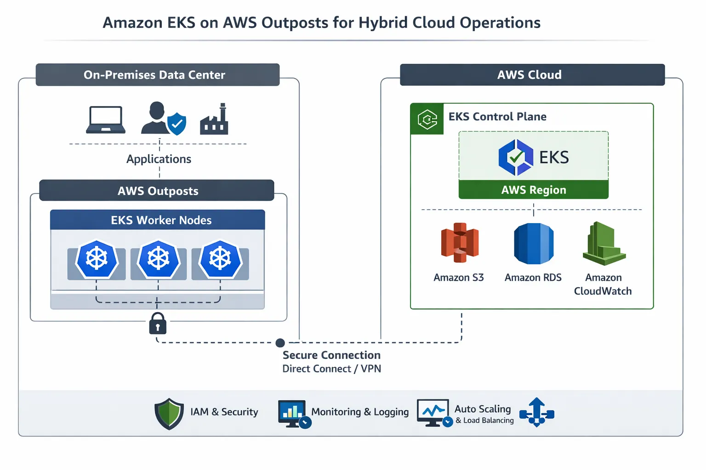

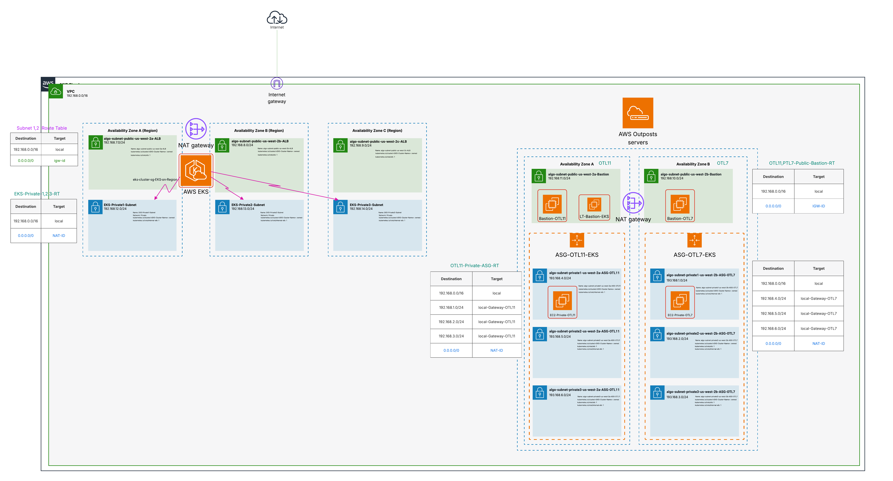

# ☸️ Amazon EKS (Control Plane) — Self-managed

### **1️⃣ Create IAM Roles**

- **Cluster IAM Role** → Create → AWS Service → **Service:** **EKS** (**EKS - Cluster**) → **Add permissions (AmazonEKSClusterPolicy**)
- **Next**
    - **Role Name**: **EKSClusterRole**
    - **Description**: Allow the **K8s Cluster Control Plane** to manage AWS Resources on your behalf
- **Node Group** needs an **EC2 Instance IAM Role** to launch and register with a cluster.
    - **Node IAM Role** → AWS Service → **Service:** **EC2** (**EC2**) → **Add permissions (AmazonSSMManagedInstanceCore**, **AmazonEKSComputePolicy**
    **AmazonEC2ContainerRegistryReadOnly**, **AmazonEKS_CNI_Policy**, **AmazonEKSWorkerNodePolicy**)
    - **Role Name**: **EKSNodeRole**
    - **Description**: Allow **EC2 Instance** to call AWS services on your behalf.

### **2️⃣ Create the EKS Cluster**

- Select **Custom Configuration**
- **🚫 Disable EKS Auto Mode**
    - **✔️** You have now disabled AWS automatic **Node** management (**Self-Managed Nodes**)
- **Kubernetes control plane location: AWS Cloud**
- **Cluster name**: **EKS-on-Region**
- **Cluster IAM Role**: **EKSClusterRole**
- Keep the rest of the configurations default, and click on **next**
- **Networking**
    - Select <Your **VPC>**
    - Select **3 Private subnets (Have only one Route Table) & Created on Region & Tag them**
        - **Route them** to **NAT** (Allows the private subnet to access the internet)
        - **Sub-Name:** <Your-Subnet-Name> (Region)
            - **Tags for all Private Subnets of outpost**
            
            ```bash
            Network: Private
            Name: <Your-Subnet-Name>
            kubernetes.io/cluster/<EKS-Cluster-Name>: shared
            # ALB works inside the VPC only (Private Subnet)
            kubernetes.io/role/internal-elb: 1
            ```

- **Security Group (Skip it)**
    - **Security Group will be created by default — Control Plane**
        
        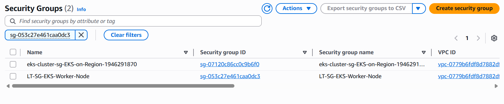


| **Firewall**             | **SG for Control Plane**                                           | **SG for Worker Node**                                           |
|-------------------------------|-----------------------------------------------------|---------------------------------------------------|
| **SG for Inbound & Outbound** | 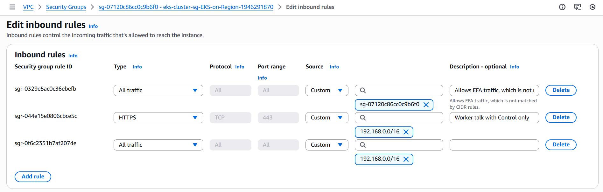     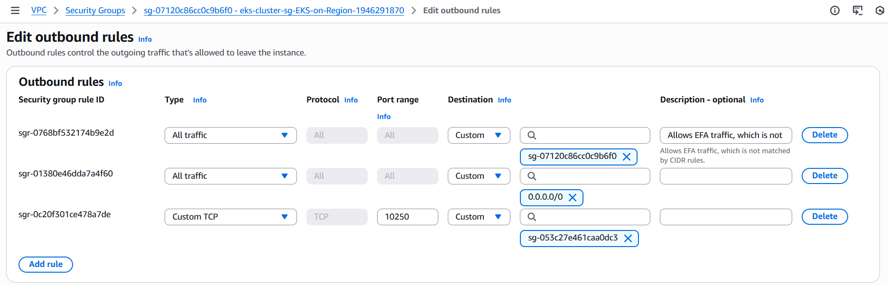          |        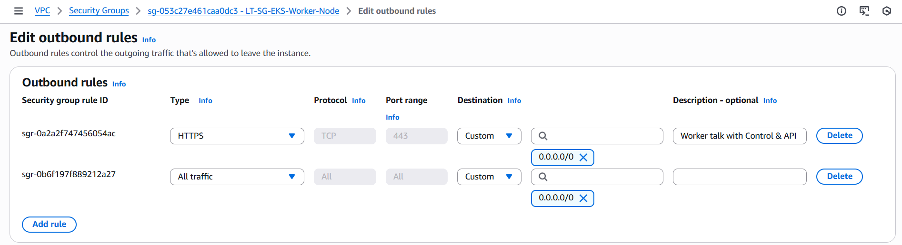          | 

            
- **Cluster endpoint access** → **Private (Access Cluster from inside VPC only)**
- Keep the rest of the configurations default, and click on **next**
- Skip Observability changes and click on **next**
- **Add the following** **add-ons**:
    
    - **Amazon VPC CNI**
    - **kube-proxy**
    - **CoreDNS**
     
    - *Amazon EBS CSI Driver*
    - *Amazon EKS Pod Identity Agent*
    - *Metrics Server*
    
- **Next** → **Next**
- Review and create the cluster.

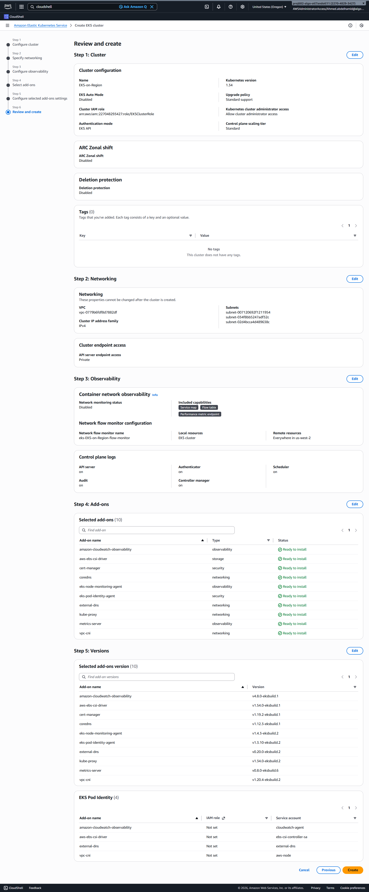

- **Wait 8–10 minutes for provisioning**
    
    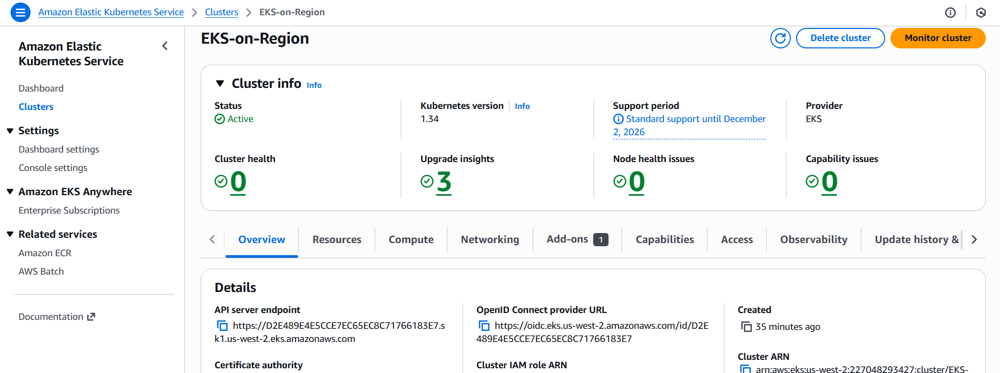

### 3️⃣ **Create a Node Group**

- **EKS Cluster** is working (**without Node Group**)
- Managed **Nodegroups** are not supported on **Outposts**
---

# 🧠 Self-Managed Worker Nodes

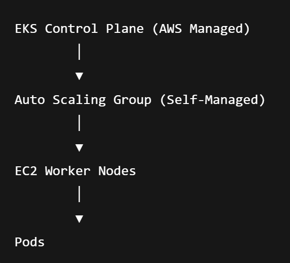

## **📌 Create 3 Launch Templates**

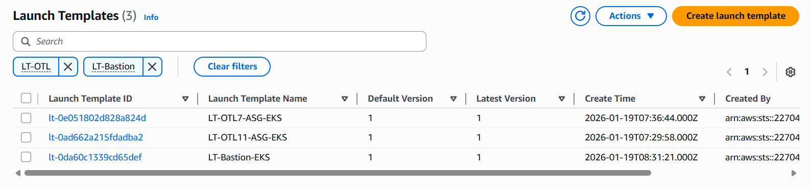

- [**Amazon Machine Image (AMI):**](https://drive.google.com/file/d/19jXw987_m8tNmgJ4KWm-3iEChIin9xfD/view?usp=sharing)
    - Before choosing **AMI-xx**, ensure that the **Amazon-eks-node**
    - From **Community AMIs (500): Search for EKS Optimized**
        - Choose the right one
    - After choosing the right **ami**, check that `kubelet` installed through `sudo systemctl status kubelet` via `SSM`

- **Instance type — OTL11  m5.xlarge**

- **Instance type — OTL7 c5.xlarge**

- **Instance type —  m5.xlarge (Bastion)**
- **Key pair name: <LT-EKS-WN>**
- **Networking:**
    - **Subnet: Don't include in launch template**
    - **Availability Zone: Don't include in launch template**
    - **Security Group:**
        - **Name:** **LT-SG-EKS-Worker-Node**
        - **Security Group:** Add →  **SGs — Worker Node**
- **EBS Volume:** **20GB, gp2**
- **Advanced details**
    - **IAM instance profile**
            
        - **Add  Role for Launch Template**
        - **Role Name:** **EKSNodeRole**
        
        - **Create a Role for Bastion**
            - **Use Case:** **EC2** (EC2)
            - **Add permissions**
            - **Role Name:** **abdelhamid-SSM-Role**
            - Attach it to **EC2**
        - **Connect with EC2**
            - **AWS Systems Manager** → Session Manager → Start session
    - **Metadata response hop limit: 2**
    - [**User Data](https://awslabs.github.io/amazon-eks-ami/nodeadm/) for (Launch Template) — [NodeConfig](https://awslabs.github.io/amazon-eks-ami/nodeadm/doc/examples/)**

```bash
MIME-Version: 1.0
Content-Type: multipart/mixed; boundary="==BOUNDARY=="

--==BOUNDARY==
Content-Type: text/x-shellscript; charset="us-ascii"

#!/bin/bash
set -ex
# If any command fails → the script stops immediately ❌

--==BOUNDARY==
Content-Type: application/node.eks.aws

---
apiVersion: node.eks.aws/v1alpha1
kind: NodeConfig
spec:
  cluster:
    name: <EKS-Cluster-Name>
    apiServerEndpoint: <EKS-endpoint>
    certificateAuthority: <EKS-certificate-Authority>
    # ➜ The **IP range** from which the **Pods** will take an IP address
    cidr: "10.100.0.0/16"
  kubelet:
    config:
      maxPods: 110
  node:
    labels:
      app: my-app
      # Kubernetes will not be able to differentiate between OTL1 and OTL7
      # outpost: otl7
      # outpost: otl11
      eks.amazonaws.com/capacityType: ON_DEMAND

--==BOUNDARY==--
```

- **User Data for (BastionTemplate)**

```bash
#!/bin/bash
yum update -y
sudo yum install -y awscli 
# Install kubectl
curl -LO https://dl.k8s.io/release/$(curl -Ls https://dl.k8s.io/release/stable.txt)/bin/linux/amd64/kubectl
chmod +x kubectl
sudo mv kubectl /usr/local/bin/ 
kubectl version --client
```
---

## 📌 **Create 2 Auto Scaling Groups**

**We will create 2 Auto Scaling Groups; AWS does not allow a single instance to appear in more than one Outpost.**

- **Name: ASG-OTL11-EKS**
- **Launch template: LT-OTL11-ASG-EKS**

- **Name: ASG-OTL7-EKS**
- **Launch template: LT-OTL7-ASG-EKS**
- **VPC: 'Your-VPC'**
- **Availability Zones and subnets:**
    
    - **3 Private Subnets (OTL11)**
    
    - **3 Private Subnets (OTL7)**
- **Availability Zone distribution: Balanced best effort**
- **Load balancing: No load balancer**
- **VPC Lattice integration options: No VPC Lattice service**
- **Group size**
    - **Desired capacity: 3**
    - **Min desired capacity: 1**
    - **Max desired capacity: 7**
- **Automatic scaling - *optional: No scaling policies***
- **Instance maintenance policy: No Policy**
- **Next**

- After creating the **Auto Scaling Group**, → Check that `kubelet` is installed on **Worker Node**
    - Go to **AWS System Manager** (**SSM**) → Choose the `right ami` → Start Session → `sudo systemctl status kubelet`
        
        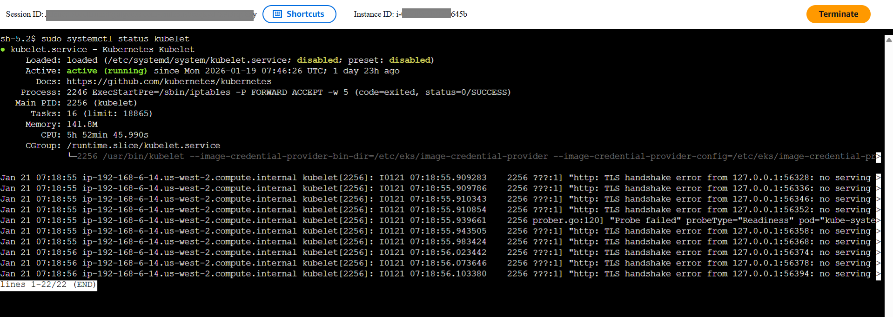     
---

### 🔍 Testing (Bastion)

**Create an EC2 Instance from Launch Template (LT-Bastion-EKS)**

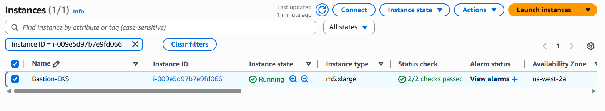

<br>
<br>
<br>
<br>


## Pre-Test Setup & Validation

| Before Testing – EKS Access | Bastion Access & Cluster Validation |
|----------------------------|-------------------------------------|
| Go to **EKS (Access)** → **IAM access entries** → **Create** | **SSH** to Bastion host |
| **IAM principal ARN:** `EKSNodeRole (Worker Node Role)` | `aws eks update-kubeconfig --region <Region> --name <EKS-Name>` |
| **Policy name:** `AmazonEKSClusterAdminPolicy` | `kubectl get ns` |
| Click **Add policy** | `kubectl get nodes` |
| 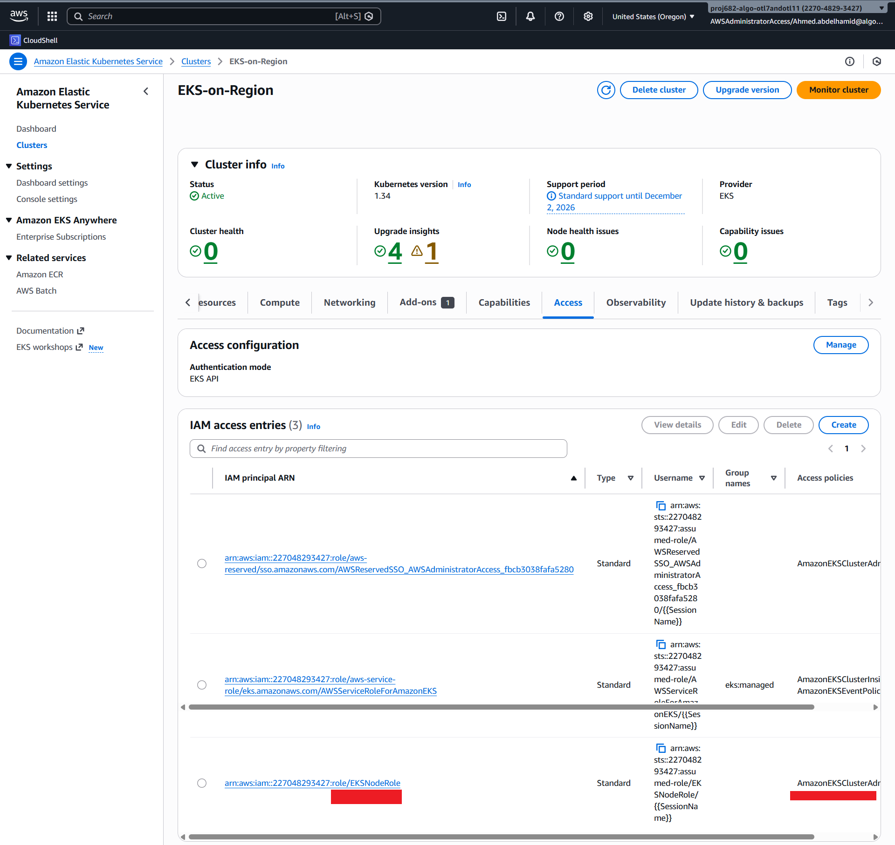 | 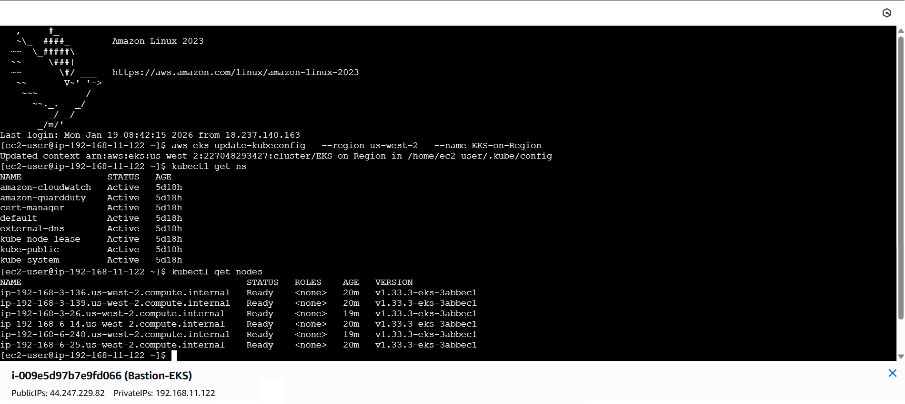  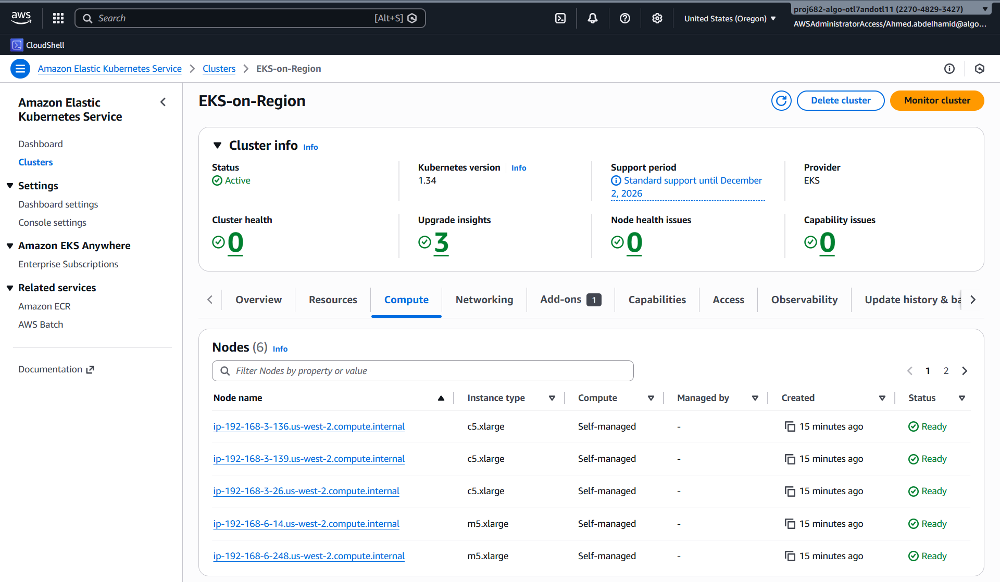|


<!-- ---

### 🚀 Deployment, Service, Ingress

### Workflows

| 🔁 ALB Workflow | ⚙️ 3-Tier Application Workflow |
|-----------------|--------------------------------|
|  |  |

- from within **Bastion Host**
    - Firstly, create a **namespace** → `kubectl create ns web`
    - Create **Deployment & Service**
        - `namespace.yaml`
        - `mongodb.yaml`
        - `backend.yaml`
        - `frontend-configmap.yaml`, `frontend.yaml`
    
    - **EBS CSI Driver Controller Pods** `CrashLoopBackOff` (**mongodb**) (**Deprecated**)
    
    ```yaml
    kubectl get pv
    kubectl get pvc -n <namespace-name>
    kubectl get storageclass
    kubectl get pods -n kube-system | grep ebs   # CrashLoopBackOff
    
    # **Create IAM Role to Service Account** (IRSA)
    # Controller need "AmazonEBSCSIDriverPolicy" Policy 
    # Need Admin Policy to create Role then delete admin policy
    eksctl create iamserviceaccount \
      --cluster EKS-on-Region \
      --namespace kube-system \
      --name *ebs-irsa-abdelhamid* \
      --attach-policy-arn arn:aws:iam::aws:policy/service-role/AmazonEBSCSIDriverPolicy \
      --region us-west-2 \
      --approve
    
    # Check that ***Service Account*** created
    kubectl describe sa ebs-csi-controller-sa -n kube-system
    # If you want to delete **Service Account**
    kubectl delete serviceaccount <Service-Account-Name> -n kube-system
    # List ***All Service Account***
    kubectl get sa -n kube-system | grep ebs
    
    # Display **IAM Role** to add it to "Amazon EBS CSI Driver"
    # Name of Role in the "**annotations**"
    kubectl get sa *ebs-irsa-abdelhamid* -n kube-system -o yaml
    〽️〽️〽️〽️〽️〽️〽️〽️〽️〽️〽️〽️〽️〽️〽️〽️〽️〽️〽️〽️〽️〽️〽️〽️〽️
    
    # You can skip this
    # Attach **Add-ons** to Role if **Addon-ons** exist
    aws eks update-addon \
      --cluster-name <your-cluster-name> \
      --**addon-name** *aws-ebs-csi-driver* \
      --service-account-role-arn arn:aws:iam::<ACCOUNT_ID>:role/<**ROLE_NAME**>
    
    # Check addon status --→ "status: ACTIVE"
    aws eks describe-addon \
      --cluster-name EKS-on-Region \
      --addon-name *aws-ebs-csi-driver* \
      --region us-west-2
    〽️〽️〽️〽️〽️〽️〽️〽️〽️〽️〽️〽️〽️〽️〽️〽️〽️〽️〽️〽️〽️〽️〽️〽️〽️
    
    # Go to EKS Cluster **add add-ons** Amazon EBS CSI Driver then "IAM roles for service accounts (IRSA)" choose **Role**
    
    # Ensure that "EBS pod" Running
    kubectl get pods -n kube-system | grep ebs
    
    # Delete "old Pod & PVC"
    kubectl delete pod mongo-0 -n abdelhamid-ns
    kubectl delete pvc mongo-storage-mongo-0 -n abdelhamid-ns
    
    # Check "New Pod & PVC"
    kubectl get pvc -n abdelhamid-ns
    kubectl get pods -n abdelhamid-ns
    
    ```
    
    - **EBS Volume**
    
    
    
    
    
    ```yaml
    kubectl apply -f namespace.yaml
    kubectl apply -f mongodb.yaml
    kubectl apply -f backend.yaml
    kubectl apply -f frontend-configmap.yaml
    kubectl apply -f frontend.yaml
    ```
    
    - Create [**Ingress**](https://kubernetes.io/docs/concepts/services-networking/ingress/) → `ingress.yaml`
        - [**Ingress annotations**](https://kubernetes-sigs.github.io/aws-load-balancer-controller/v2.7/guide/ingress/annotations/) -->