# 📖 Simple 3-Tier Web Application

This project is a simple 3-tier web application with a static frontend and a Node.js backend. The frontend is served by Nginx, while the backend is built with Express.js.

## 📂 Project Structure
```
simple-3-tier-app/
├── assets/            # Contains project images
├── Backend/           # Node.js (Express) API
├── FrontEnd/          # Static HTML served by Nginx
├── K8s-Local/         # Deploy K8s through minikube
├── K8s-EKS-Region/    # Deploy k8s manifests through Amazon EKS
├── docker-compose.yml
└── README.md
```


## 💻 Test Local firstly
to test locally

```
Deploy simple-3-tier-app locally
│
├── Backend/
│   │
│   ├── .env
│   │     PORT=3000
│   │     // MONGO_URI=mongodb://mongo-service:27017/counterdb   # EKS
│   │     MONGO_URI=mongodb://localhost:27017/counterdb          # Local
│   │
│   ├── app.js
│   ├── npm install express cors mongoose dotenv
│   |    │
│   |    ├── node_modules/
│   |    └── package.json
│   |
│   # Run MongoDB locally using Docker
│   └─── docker run -d -p 27017:27017 --name mongo mongo
│   |
│   # Run Backend API
│   └─── node app.js
│
│
├── FrontEnd/
│   │
│   ├── index.html
│   │     // const backendUrl = "/api/increment";                    # EKS / Ingress
│   │     const backendUrl = "http://localhost:3000/api/increment";  # Local testing
│   │
│   # Run Frontend server
│   └── python -m http.server 5500
```

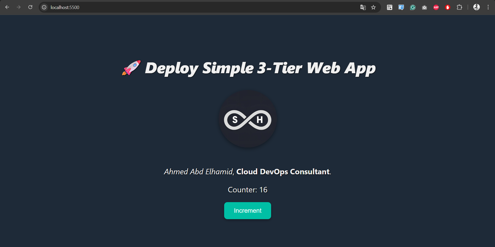

---

## 📄 Prepare Dockerfile

### 📁 Backend Structure
```
Backend/
├── app.js
├── package.json
├── package-lock.json  (.gitignore)
├── node_modules       (.gitignore)
├── .env
└── Dockerfile
```
📄 Dockerfile
```
FROM node:20.11.1-alpine3.19
WORKDIR /app
COPY package*.json ./
RUN npm install --only=production
COPY . .
# Expose backend port
EXPOSE 3000
CMD ["node", "app.js"]
```

<br>

```
docker build -t backend-app .
```

<br>

### 📁 Frontend Structure
```
FrontEnd/
├── index.html
├── Dockerfile
└── nginx.conf   (import for Ingress/api to work well)
```
🏠📄nginx.conf

```
server {
    listen 80;

    location / {
        root /usr/share/nginx/html;
        index index.html;
        try_files $uri /index.html;
    }

    location /api/ {
        #(backend:3000) → Name of Backend Service in "Kubernetes" 
        proxy_pass http://backend:3000;
        proxy_set_header Host $host;
        proxy_set_header X-Real-IP $remote_addr;
    }
}
```

📄 Dockerfile

```
FROM nginx:alpine

# Remove default config
RUN rm /etc/nginx/conf.d/default.conf

# Copy custom nginx config
COPY nginx.conf /etc/nginx/conf.d/default.conf

COPY index.html /usr/share/nginx/html/index.html

EXPOSE 80
```

<br>

```
docker build -t frontend-app .
```

#### 🐳 Test locally through "Docker"

```
# Create Network
docker network create app-net

docker run -d --name mongo --network app-net mongo

// Container Name of "backend-app" image must be the same name in "nginx.conf" -→ http://backend:3000
docker run -d --name backend --network app-net -e MONGO_URI=mongodb://mongo:27017/counterdb backend-app

docker run -d --name frontend --network app-net -p 8000:80 frontend-app
```

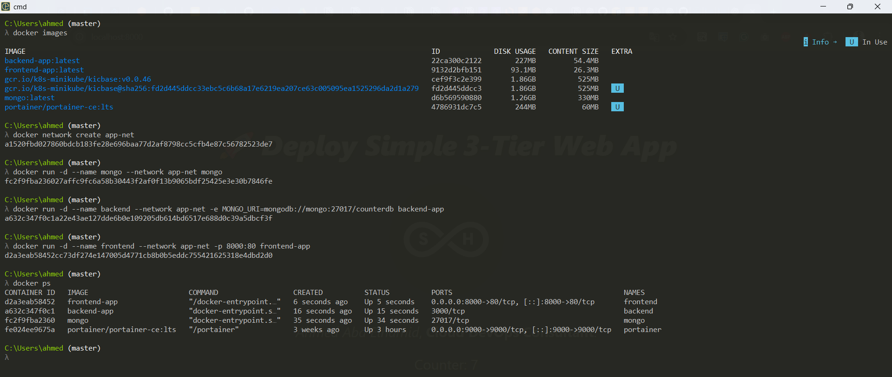
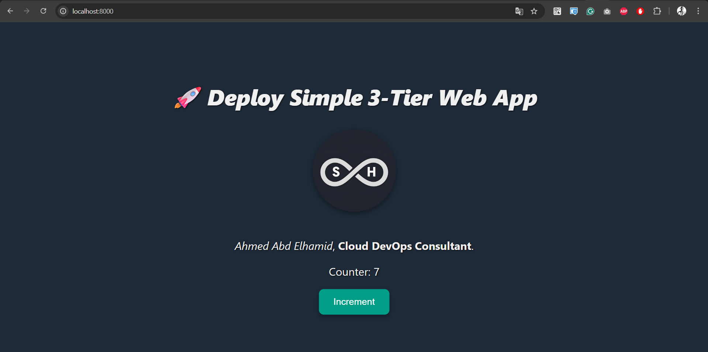


#### 🏷️🚀 Tag & Push image
```
# Tag Image
docker tag <Image-Name> <Docker_Hub-User>/<Image-Name> 
# Push Image
docker push <Docker_Hub-User>/<Image-Name>
```
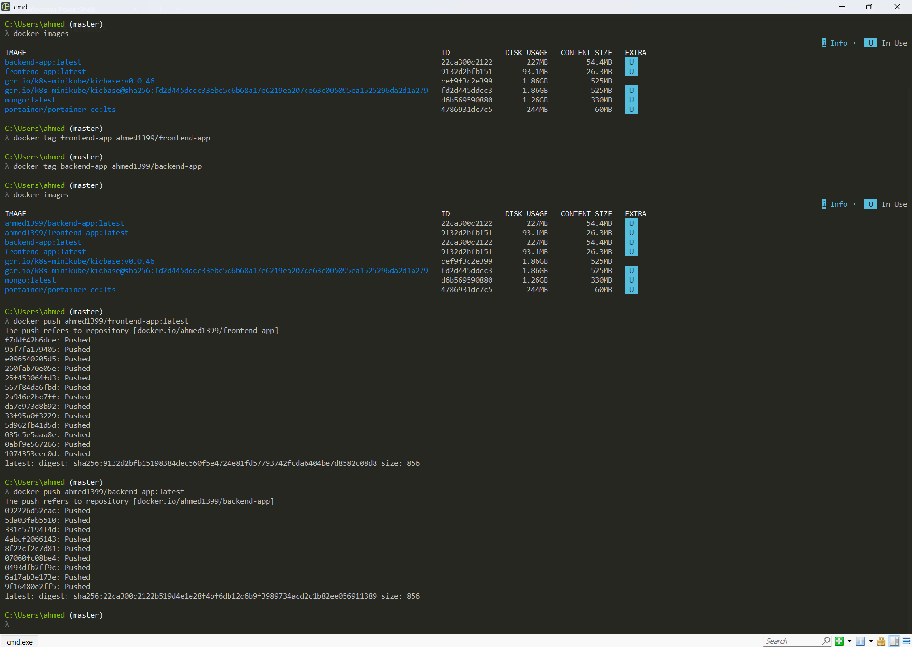
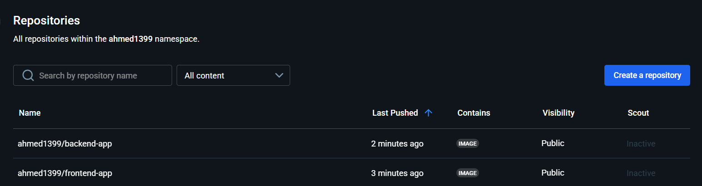
---

## 📄☸️ Prepare Kubernetes manifest files

You can check (K8s manifest files) from here [EKS Files](https://github.com/Ahmed-1399/EKS-Outpost/tree/main/Simple-3-tier-app/K8s-Local)

#### 🚀❌ Deploy or Remove using:
```
#!/bin/bash

kubectl apply -f namespace.yaml
kubectl apply -f mongodb.yaml
kubectl apply -f backend.yaml
kubectl apply -f frontend-configmap.yaml
kubectl apply -f frontend.yaml

# kubectl delete -f mongodb.yaml
# kubectl delete -f backend.yaml
# kubectl delete -f frontend-configmap.yaml
# kubectl delete -f frontend.yaml
# kubectl delete -f namespace.yaml
```
```
minikube service frontend-service -n abdelhamid-ns
```

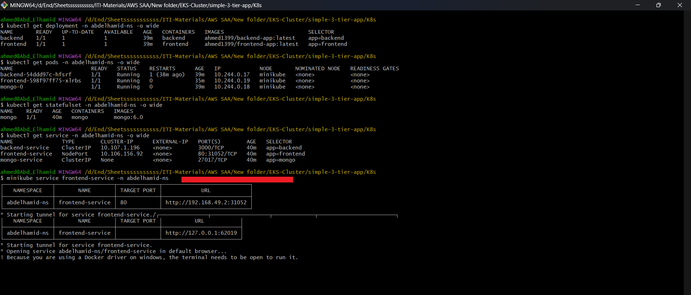
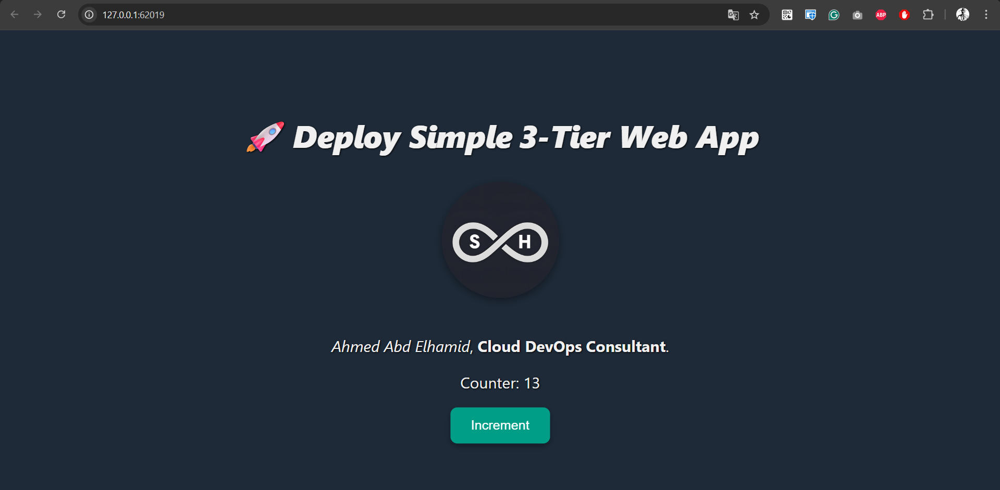


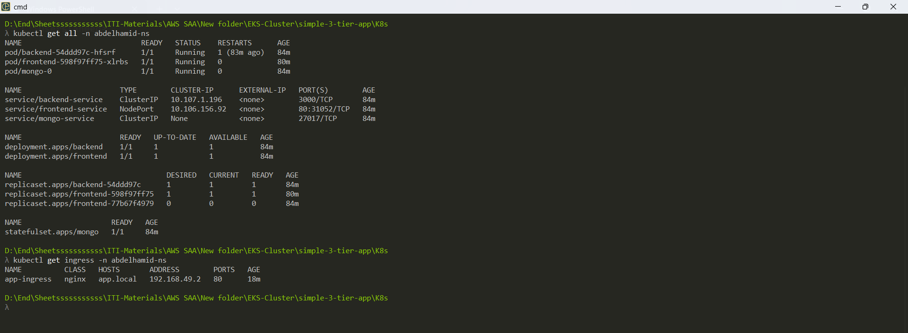

<br>
<br>

# ☸️ Production (EKS)
You can check (K8s manifest files) from here: [EKS Files](https://github.com/Ahmed-1399/EKS-Outpost/tree/main/Simple-3-tier-app/K8s-EKS-Region)


<br>

## 🚀 Deployment, Service, Ingress

### ♻️ Workflows

| 🔁 ALB Workflow | ⚙️ 3-Tier Application Workflow |
|-----------------|--------------------------------|
| 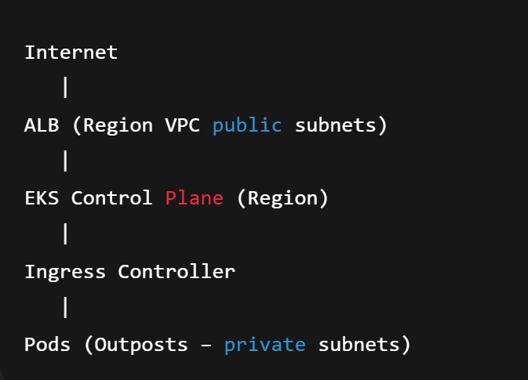 | 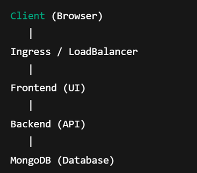 |

- from within **Bastion Host**
    - Firstly, create a **namespace**
    - Create **Deployment & Service**
    - Create **Ingress**
        - `namespace.yaml`
        - `mongodb.yaml`
            - **To save data in MongoDB persistently**, we will use the **Amazon EBS CSI Driver**
            - Some problems will face you, so to solve them. Check the steps to solve the problem with the **Amazon EBS CSI Driver** (**Deprecated**).
        - `backend.yaml`
        - `frontend-configmap.yaml`, `frontend.yaml`
        - `ingress.yaml`
    
    - **Amazon EBS CSI Driver** `CrashLoopBackOff` (**mongodb**) (**Deprecated**)
        - `ebs-csi-controller-sa`
    
    ```docker
    # The problem that will face you
    kubectl get pods -n kube-system | grep ebs   # **CrashLoopBackOff**
    
    # **Create IAM Role** & attach it with Service Account to talk with EBS & create volume
    eksctl create iamserviceaccount \
      --cluster <EKS-Cluster-Name> \
      --namespace kube-system \
      --name **ebs-csi-controller-sa** \
      --role-name ebs-csi-controller-sa-abdelhamid \
      --attach-policy-arn arn:aws:iam::aws:policy/service-role/AmazonEBSCSIDriverPolicy \
      --region <Region> \
      --approve \
      --override-existing-serviceaccounts
    
    # Ensure that **Service Account** exist 
    kubectl get sa **ebs-csi-controller-sa** -n kube-system
    
    # Display **Role ARN** 
    role_arn=$(aws iam get-role --role-name ebs-csi-controller-sa-abdelhamid --query 'Role.Arn' --output text)
    # Update add-ons with **new Role**
    aws eks update-addon \
      --cluster-name <EKS-Cluster-Name> \
      --addon-name ***aws-ebs-csi-driver*** \
      --service-account-role-arn $role_arn \
      --region <Region>
    
    # Ensure that **Add-ons active**
    aws eks describe-addon --cluster-name <EKS-Cluster-Name> --addon-name ***aws-ebs-csi-driver*** --region <Region> --query "addon.status"
    
    # to accelerate the process
    kubectl delete pod -n kube-system -l app.kubernetes.io/name=aws-ebs-csi-driver
    
    # Ensure that **pod of ebs** **run**
    # ebs-csi-controller, ebs-csi-node (**Run**)
    kubectl get pods -n kube-system | grep ebs
    
    # persistentVolume(PV) will be created automatically
    kubectl get pv
    # Bound
    kubectl get pvc -n <namespace-name>
    kubectl get storageclass
    ```
    
    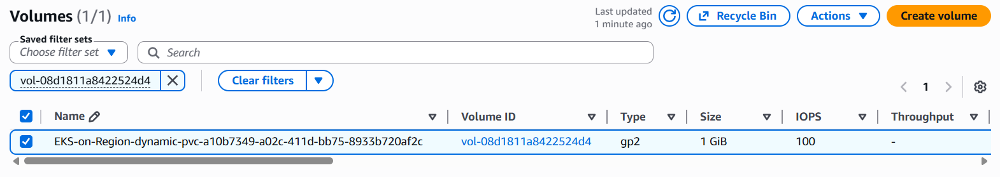
    
    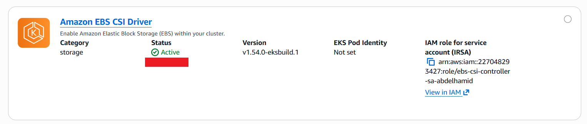
    
    - If you face a problem during activation `Amazon EBS CSI Driver` install **Amazon EBS CSI Driver** through **Manual manifest files (for full control)**
    
    ```docker
    # -----------> Install EBS-CSI-Driver through **manifest**
    
    # **Create IAM Role** & attach it with Service Account to talk with EBS & create volume
    eksctl create iamserviceaccount \
      --cluster <EKS-Cluster-Name> \
      --namespace kube-system \
      --name **ebs-csi-controller-sa** \
      --role-name *My-EBS-CSI-Role* \
      --attach-policy-arn arn:aws:iam::aws:policy/service-role/AmazonEBSCSIDriverPolicy \
      --region <Region> \
      --approve \
      --override-existing-serviceaccounts
    
    # Install the **Driver** "**ebs-csi-controller-sa**" automatically
    kubectl apply -k "github.com/kubernetes-sigs/aws-ebs-csi-driver/deploy/kubernetes/overlays/stable/?ref=release-1.34" --server-side
    
    ----------
    # **Regional STS**
    # Solve the problem of **STS** → **Driver** can't talk with **Global STS endpoint**
    # **5 Sidecars containers** (ebs-plugin, csi-provisioner, csi-attacher, csi-snapshotter, csi-resizer)
    ****# Important for remote region
    for container in **ebs-plugin** **csi-provisioner** **csi-attacher** **csi-snapshotter** **csi-resizer**; do
      kubectl set env deployment/ebs-csi-controller \
        -n kube-system \
        -c $container \
        AWS_STS_REGIONAL_ENDPOINTS=regional
    done
    ----------
    
    # Rerun pods
    kubectl rollout restart deployment ebs-csi-controller -n kube-system
    
    # If still pending "IAM Role has problem in **Trust Policy**"
    # must contain → **OIDC Provider**, **Name of** '**Service Account**'
    aws iam get-role --role-name *My-EBS-CSI-Role* --query 'Role.AssumeRolePolicyDocument'
    
    # Ensure that **pod of ebs** **run**
    # ebs-csi-controller, ebs-csi-node (**Run**)
    kubectl get pods -n kube-system | grep ebs
    
    # persistentVolume(PV) will be created automatically
    kubectl get pv
    # Bound
    kubectl get pvc -n <namespace-name>
    kubectl get storageclass
    ```
    
    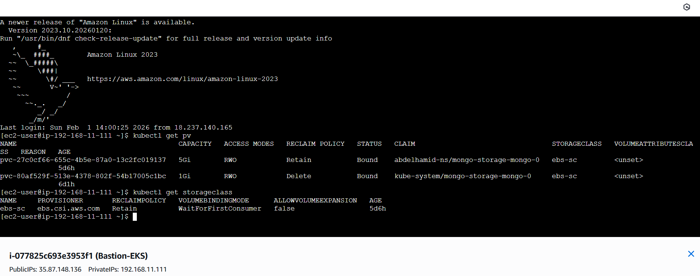
    
    ---
    

## 📌 Install ALB Ingress Controller on EKS

- Create [**Ingress**](https://kubernetes.io/docs/concepts/services-networking/ingress/) → `ingress.yaml`
    - [**Ingress annotations**](https://kubernetes-sigs.github.io/aws-load-balancer-controller/v2.7/guide/ingress/annotations/)

### Steps to install Ingress Controller from [here](https://docs.aws.amazon.com/eks/latest/userguide/lbc-helm.html)

- **install [`eksctl`](https://docs.aws.amazon.com/eks/latest/eksctl/installation.html)**
    - `eksctl version`
- 🔓 **Enable OIDC Provider (Allow Kubernetes to talk with IAM)**
    
    ```yaml
    eksctl utils associate-iam-oidc-provider \
      --region <Region> \
      --cluster <EKS-Cluster-Name> \
      --approve
    
    # Ensure that **OIDC** Added
    aws iam list-open-id-connect-providers
    
    # if you want to delete **OIDC**
    aws iam delete-open-id-connect-provider \
      --open-id-connect-provider-arn <**OIDC-ARN**>
    ```
    
- **Create an IAM Role & Service Account for each other using `eksctl` (Step1)**
    - Will not be installed until you **add admin access**, then **remove admin access**
    
    ```docker
    # Download IAM Policy (Change Version according to document)
    curl -O https://raw.githubusercontent.com/kubernetes-sigs/aws-load-balancer-controller/v2.14.1/docs/install/iam_policy.json
    
    # Create IAM Policy
    aws iam create-policy \
        --policy-name AWSLoadBalancerControllerIAMPolicy \
        --policy-document file://iam_policy.json
    
    eksctl create iamserviceaccount \
      --cluster=<EKS-Cluster-Name> \
      --namespace=kube-system \
      --name=**aws-load-balancer-controller** \
      --role-name AmazonEKSLoadBalancerControllerRole \
      --attach-policy-arn=arn:aws:iam::<Account-ID>:policy/AWSLoadBalancerControllerIAMPolicy \
      --approve \
      --region=<Region> \
      --override-existing-serviceaccounts
    ```
    
- **Install AWS Load Balancer Controller (Step2)**
    - **Install [`Helm`](https://helm.sh/docs/intro/install/#from-script)** from the script
    
    ```yaml
    helm repo add eks https://aws.github.io/eks-charts
    helm repo update
    
    # Display VPC_ID
    aws eks describe-cluster --name <EKS-Cluster-Name> --query "cluster.resourcesVpcConfig.vpcId" --output text
    
    helm upgrade --install aws-load-balancer-controller eks/aws-load-balancer-controller \
      -n kube-system \
      --set clusterName=<EKS-Cluster-Name> \
      --set serviceAccount.create=false \
      --set serviceAccount.name=**aws-load-balancer-controller** \
      --set region=<Region> \
      --set vpcId=<VPC-ID> \
      --set enableShield=false \
      --set enableWaf=false \
      --rollback-on-failure
    ```
    
    - Ensure that the **Webhook** works well
        - `kubectl get pods -n kube-system | grep aws-load` 
        `kubectl get svc -n kube-system | grep webhook`
            
            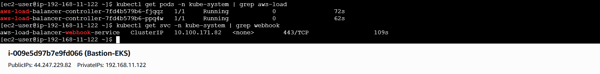
            
    - **Verify that the controller is installed (Step3)**
        - `kubectl get deployment -n kube-system aws-load-balancer-controller`
            
            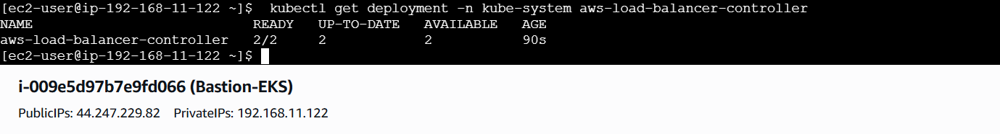
            
        
        ### ✅ Check
        

**Application Load Balancer**

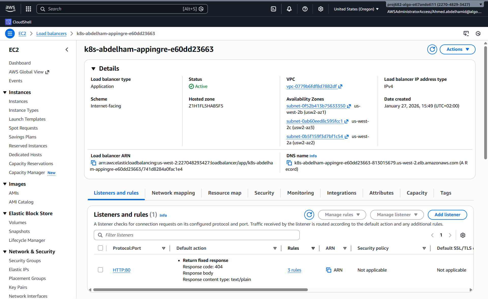

**Target Group**

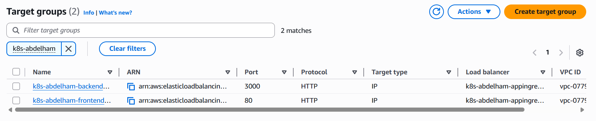

**Backend Target Group**

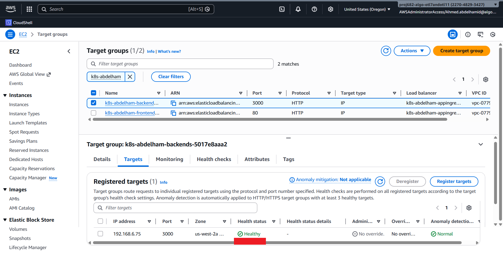

**Frontend Target Group**

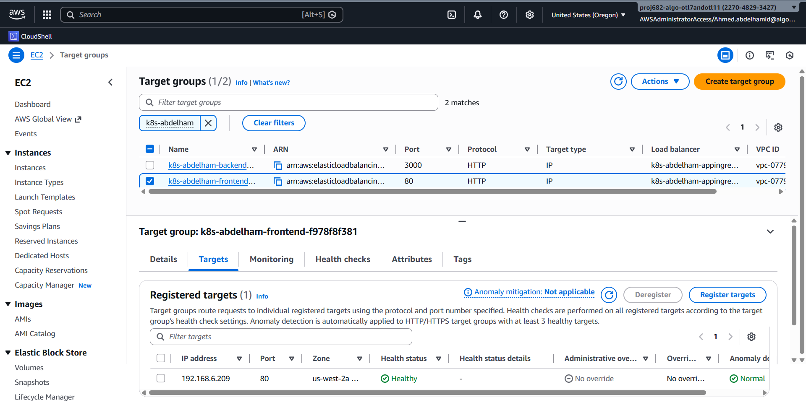

**Deployment, Service, Ingress**

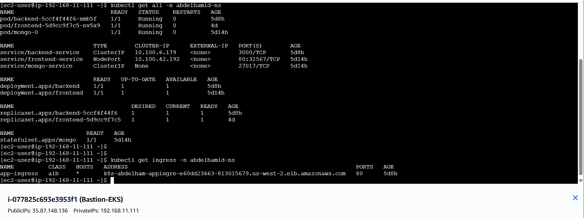

**Output**

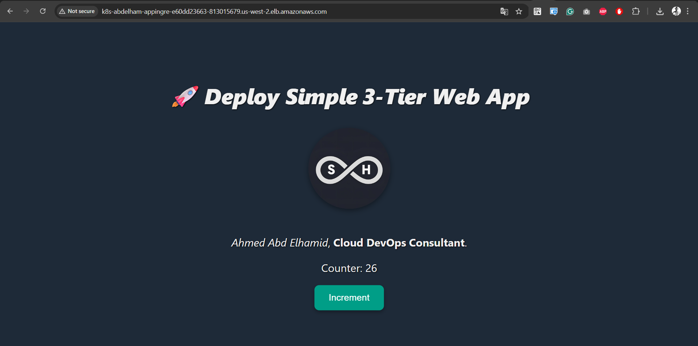
